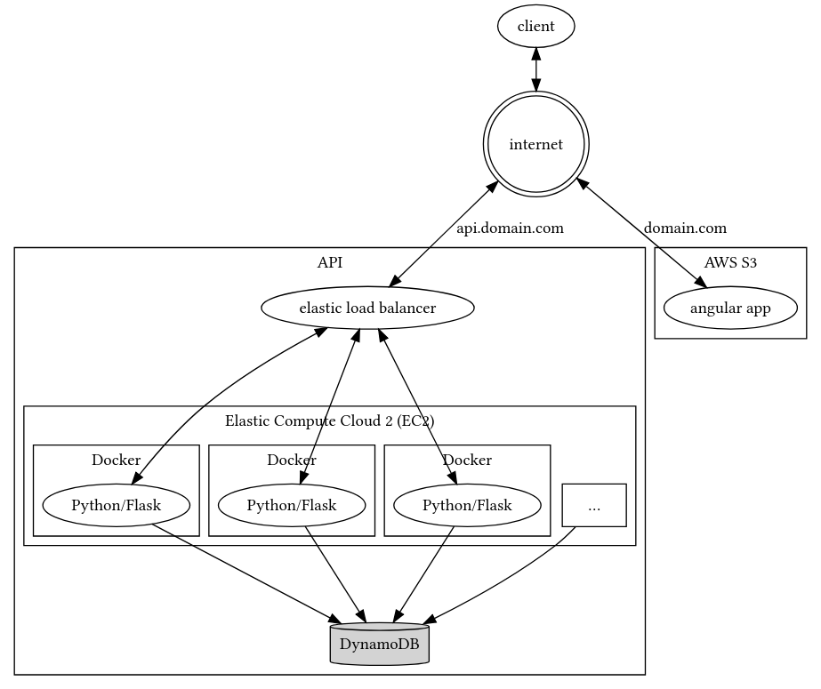

# angular-todo

Angular todo is a pet project to improve my angular/flask skills.

## Structure
This project runs both the front-end and the back-end. The back-end is called api, which can be found in the corresponding folder. All of the angular code is in front-end.

## Installation
Install the project to your server by cloning this repository:
```bash
git clone https://github.com/Drvanon/angular-todo
cd angular-todo
```
### API server install
To install the api server, make sure you have a current version of python installed as well as pipenv.
```bash
pipenv install
```

### Front end install
Make sure you have nodejs and npm installed on your server and run `npm install` in the front-end folder.

## Deployment strategy
To bring the app to it's fullest potential and making it scalable it would be highly recomendable to run it on the AWS cloud. Docker-ifying the flask application and loading it into an EC2 instance, behind an elastic load balancer should allow for scalability. Running angular to build production should allow you to copy the contents of prod into an S3 bucket. 
